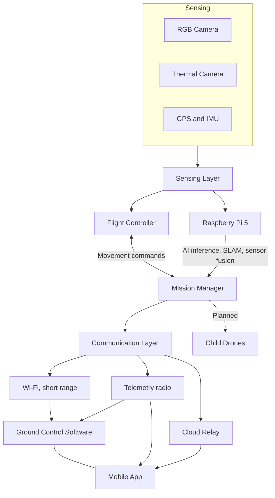

<div align="center">

# AkashX

### AI-powered autonomous drone platform for search and rescue

Detects survivors, fire, smoke and hazards from the air, streams everything to a ground station and a mobile app, and lets people in danger raise an SOS with one tap.

<br>


[Overview](#overview) | [What We Have Built](#what-we-have-built) | [Screenshots](#screenshots) | [Architecture](#architecture) | [Getting Started](#getting-started) | [Roadmap](#roadmap) | [Team](#team)

</div>

---

## Overview

After a flood, landslide or earthquake, the first hours decide who is found alive. Rescue teams often enter disaster zones with little information, and aerial search that relies only on cameras misses people who can call for help but cannot be seen.

AkashX addresses this with three connected parts:

1. **An AI drone** that finds people, fire, smoke and hazards using RGB and thermal imaging, with detection running on the drone itself so it keeps working when connectivity is poor.
2. **A command layer** made up of a desktop ground control station and a cross-platform mobile app that show live video, telemetry, maps and detections.
3. **An SOS pipeline** that lets survivors share their exact location in one tap, so the drone and responders know where to go.

The long-term goal is a mother drone that carries and releases small disposable child drones into gaps and rubble it cannot reach itself. This is described in the [Roadmap](#roadmap).

| | |
|---|---|
| **Event** | Smart India Hackathon 2026 |
| **Problem Statement** | SIH26177: a deployable AI-powered autonomous drone that aids search-and-rescue by detecting people and hazards, improving responder safety and reducing victim discovery time |
| **Category** | Hardware |
| **Theme** | Robotics and Drones |
| **Team** | AKASHX (Team ID 130495) |

---

## What We Have Built

This section lists what exists and works today. Planned work is kept separate under the [Roadmap](#roadmap).

### Detection and perception

- Multi-class detection of humans, fire, smoke and hazards using YOLOv8, with custom-trained weights (`software/best.pt`) alongside the YOLOv8 nano baseline (`software/yolov8n.pt`).
- A custom training dataset of roughly 25,000 images, prepared and trained by the team.
- OpenCV-based image processing for autonomous image sensing.
- A working beta that demonstrates AI-based detection on a prebuilt drone, validating the core perception pipeline.

### Ground Control Software (desktop)

- Live video feed with a dedicated panel for victim captures and another for fire and smoke captures.
- Live map view with markers for detections and the drone position.
- Keyboard flight controls and a safety panel with arm, disarm and emergency actions.
- Telemetry and system status readouts, with command and event logs.

### Mobile application (Flutter)

- Cross-platform app built in Flutter for Android and iOS from a single codebase.
- Live video, detection status and telemetry (altitude, battery, speed, signal, latitude and longitude).
- SOS button with the user's current location.

### Cloud and communication

- Cloud relay for control and streaming beyond physical radio range (`CloudCenter`).
- SOS listener service and local SOS record storage (`sosListener.py`, `sos_store.py`).
- Geo-coordinate conversion and altitude synchronisation between components.
- Video streaming server for live feed delivery (`videoServer.py`).

### Navigation and autonomy

- Dead reckoning and inertial navigation modules for positioning when GPS is unavailable (`INSCenter`).
- Autonomous flight logic and autonomous command handling (`AutonomusCenter`).
- Semi-autonomous flight features, with simulation-based testing of autonomous behaviour.

### Engineering practices

- Modular codebase: flight, AI processing, sensing, communication, UI and cloud are separate packages that can be developed and tested independently.
- A single source of truth for configuration in `ConstantsCenter`.

---

## Screenshots

<table>
  <tr>
    <td align="center" width="62%">
      
      <br><b>Ground Control Software</b>
      <br>Live video, victim and fire captures, map, controls and safety panel
    </td>
    <td align="center" width="38%">
      
      <br><b>Mobile App</b>
      <br>Detection status, telemetry and SOS
    </td>
  </tr>
</table>
---

## Architecture

The system is built around a mother drone that handles flight, perception and mission planning, with a communication layer that connects it to the ground station, the mobile app and the cloud relay. The child drone link is part of the planned extension.



### Subsystem summary

| Subsystem | Responsibility |
|---|---|
| Sensing layer | Collects RGB, thermal and GPS/IMU data |
| Flight controller | Stabilisation, motor control and failsafes |
| Raspberry Pi 5 | On-device AI inference, SLAM and sensor fusion |
| Mission manager | Priority scoring, geotagging and route planning |
| Communication layer | Wi-Fi, telemetry radio and cloud relay fallback |
| Ground Control Software | Live video, telemetry, altitude and mission data |
| Mobile app | SOS trigger, live map, push alerts and navigation |

Failsafes are part of the design: low-voltage return-to-home from the power system, and automatic return-to-home if the Raspberry Pi fails.

---

## Technology Stack

| Area | Technologies |
|---|---|
| Drone and ground software | Python, Tkinter |
| Computer vision and AI | YOLOv8 (Ultralytics), OpenCV |
| Mobile application | Flutter, Dart (Android and iOS) |
| Web dashboard | HTML, CSS, JavaScript |
| Cloud | Cloud relay, SOS listener and sync services |
| Navigation | Dead reckoning, inertial navigation, SLAM (planned) |
| Edge compute | Raspberry Pi 5 |
| Platforms | Windows, Linux |

---

## Repository Structure

```
.
├── main.py                           Application entry point
├── requirements.txt                  Python dependencies
│
├── AutonomusCenter/                  Autonomous flight logic
│   ├── AutonomusCommandsCenter/
│   └── autonomusFlight.py
│
├── CloudCenter/                      Cloud relay and SOS pipeline
│   ├── altitudeSync.py
│   ├── cloudTesting.py
│   ├── geoConvert.py
│   └── sosListener.py
│
├── CommandsCenter/                   Drone command generation
│   └── Commands.py
│
├── CommunicationCenter/              Drone-to-ground communication
│   ├── Streaming.py
│   ├── communication.py
│   └── sos_store.py
│
├── ConstantsCenter/                  Central configuration
│   └── constants.py
│
├── DisplayCenter/                    Ground control UI
│   └── Display.py
│
├── FrontEndCenter/                   Web dashboard
│   ├── website.css
│   ├── website.html
│   └── wensite.js
│
├── GlobalVideoStreamingCenter/       Video streaming
│   ├── software/
│   └── videoServer.py
│
├── INSCenter/                        Navigation
│   ├── DeadReckoningSystem.py
│   └── IntertialNavigationSystem.py
│
├── software/                         Detection model weights
│   ├── best.pt
│   └── yolov8n.pt
│
└── oldFiles/                         Deprecated, reference only
```

---

## Getting Started

### Prerequisites

- Python 3.8 or higher
- pip and a virtual environment tool
- Windows, Linux or macOS

### Installation

```bash
git clone https://github.com/DarshiL-Sharma/AkashX.git
cd AkashX

python -m venv .venv
# Windows
.venv\Scripts\activate
# Linux / macOS
source .venv/bin/activate

pip install -r requirements.txt
```

### Run

```bash
python main.py
```

This launches the ground control interface. Make sure the model weights in `software/` are present before starting detection.

---

## Development Conventions

- **Constants:** all tunable values live in `ConstantsCenter/constants.py`, in `ALL_CAPS_WITH_UNDERSCORES`. No hardcoded values in other modules.
- **Module independence:** each `*Center` package is self-contained. Avoid circular imports.
- **Import paths:** do not rename or move modules without team agreement.
- **Safety-critical changes:** changes to flight limits or failsafe behaviour need a pull request with a clear reason and test notes.
- **Deprecated code:** files in `oldFiles/` are never imported.

Workflow: branch from `main` as `feature/short-description`, keep changes focused, test locally, and open a pull request that explains what changed and why.

---

## Roadmap

### Next up: multi-drone system

- [ ] Mother drone that carries and releases disposable child drones into gaps and rubble
- [ ] Child drone link over Wi-Fi or telemetry, with onboard stabilisation, SLAM and sensing
- [ ] Mission manager that assigns areas to child drones and merges their detections

### SOS and emergency response

- [x] One-tap SOS in the mobile app with location sharing
- [X] Automatic drone dispatch to the SOS location
- [ ] Integrated 112 emergency call from the app
- [ ] Android smartwatch app for SOS from the wrist
- [ ] iOS smartwatch app for SOS from the wrist
- [ ] Push alerts to responders

### Autonomy and navigation

- [x] Dead reckoning and inertial navigation modules
- [ ] SLAM-based obstacle avoidance and visual localisation in GPS-denied areas
- [ ] Fully autonomous search patterns with priority scoring of detections
- [ ] Fastest-path routing for rescue teams using live cloud data

### AI and perception

- [x] Multi-class detection of humans, fire, smoke and hazards
- [ ] Improved detection of partially buried and covered victims
- [ ] Hardware AI acceleration on the Raspberry Pi 5 (Hailo-8 under evaluation)
- [ ] Larger, more diverse training dataset

### Hardware

- [ ] Full airframe build: 450 mm frame, BLDC motors, 10 to 12 inch propellers, Pixhawk flight controller
- [ ] RGB plus FLIR thermal payload
- [ ] 915 MHz telemetry link
- [ ] Child drone: roughly 65 mm micro-frame with ESP32 flight controller and spring-release bay
- [ ] Field testing, then DGCA and DigitalSky compliance

### Platform

- [ ] Multi-drone coordination in the ground station
- [ ] Offline-first cloud synchronisation
- [ ] Hardware abstraction layer for multiple drone platforms
- [ ] Formal documentation site

### Target specifications (estimates, to be finalised)

| | Mother drone | Child drone |
|---|---|---|
| Weight | about 1.8 to 2.0 kg | about 150 to 200 g |
| Flight time | about 18 to 22 min | about 5 to 7 min per mission |
| Communication range | Telemetry and cloud relay | about 50 to 80 m (Wi-Fi/telemetry, rubble-dependent) |
| Estimated total cost | Rs 70,000 to 90,000 for a mother drone with 3 to 4 child units | |

These figures are estimates based on the current bill of materials and will change as the hardware is finalised.

---

## Team

Team AKASHX, Smart India Hackathon 2026.

| Role | Name | Focus |
|---|---|---|
| Team Lead | **Darshil Sharma** | Project lead. Control system and navigation system. Software UI/UX. Android application and frontend development. Semi-autonomous features. |
| Co-Lead | **Ayush Nainawdiya** | Project guide. Testing, autonomous image sensing, YOLO and OpenCV. |
| Team Member | **Ayushi Kuravle** | Frontend development and research. |
| Team Member | **Aryan Kumar** | Autonomous feature development and testing in the virtual environment. |
| Team Member | **Arpit Charpe** | Software UI/UX development. Training of the 25,000-image dataset. |
| Team Member | **Dhruv Goud** | Hardware testing and control, research, and content creation. |

---

## Contributing

Contributions, bug reports and ideas are welcome. Please open an issue first to discuss larger changes, and make sure that tests pass and constants are kept in `ConstantsCenter` before opening a pull request.

---

## References

- Ultralytics YOLOv8: https://docs.ultralytics.com/models/yolov8
- Raspberry Pi 5: https://www.raspberrypi.com/products/raspberry-pi-5/
- Hailo-8 AI accelerator: https://hailo.ai/products/ai-accelerators/hailo-8-ai-accelerator/
- NDMA: https://ndma.gov.in/
- NDRF: https://ndrf.gov.in/
- DGCA RPAS guidelines: https://www.dgca.gov.in
- DigitalSky: https://digitalsky.dgca.gov.in
- PDSR: UAV swarm deployment for post-disaster search and rescue: https://arxiv.org/pdf/2410.22982
- Bio-inspired swarm UAV framework for SAR, Scientific Reports: https://www.nature.com/articles/s41598-025-33223-z

---

## License

Released under the MIT License. See the `LICENSE` file for details.

<div align="center">

**Team AKASHX** | Smart India Hackathon 2026

Maintained by [Darshil Sharma](https://github.com/DarshiL-Sharma)

</div>
